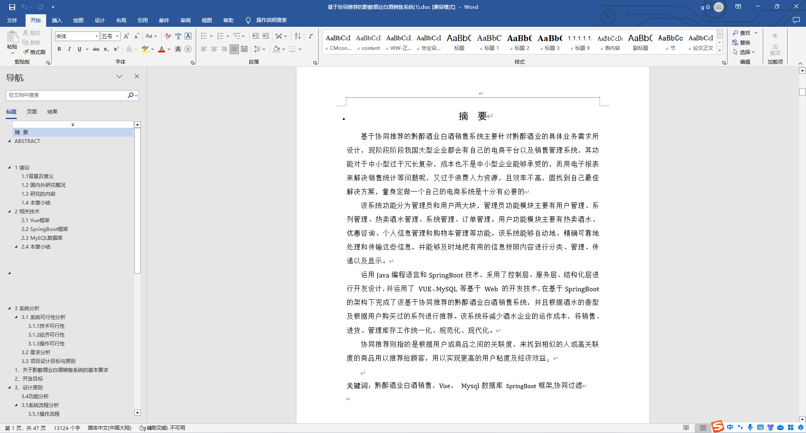
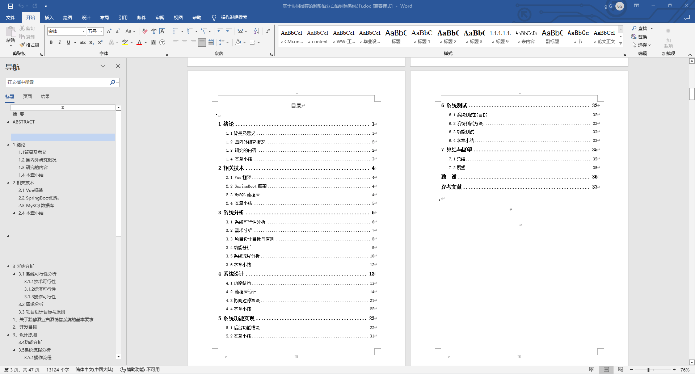
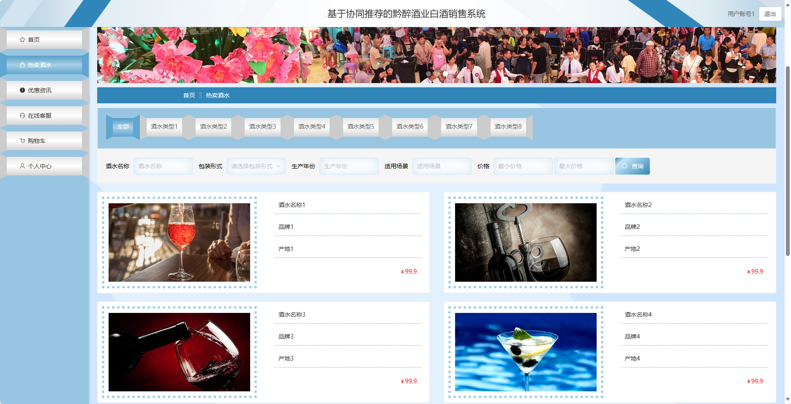
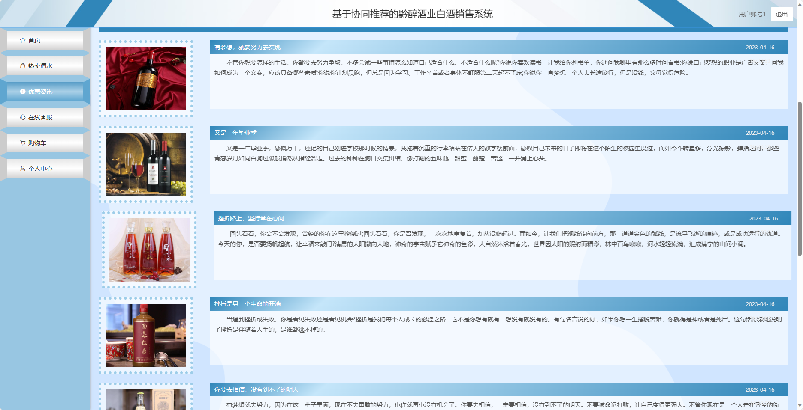
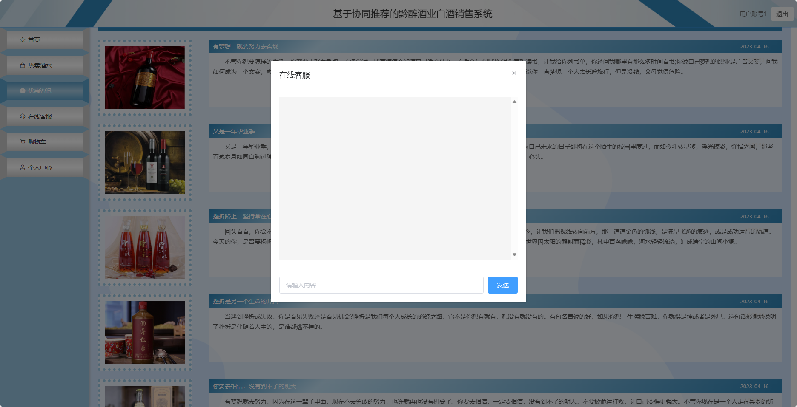
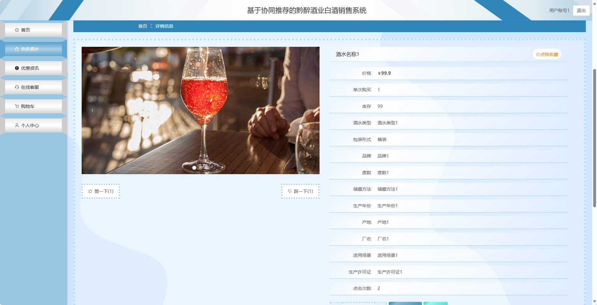
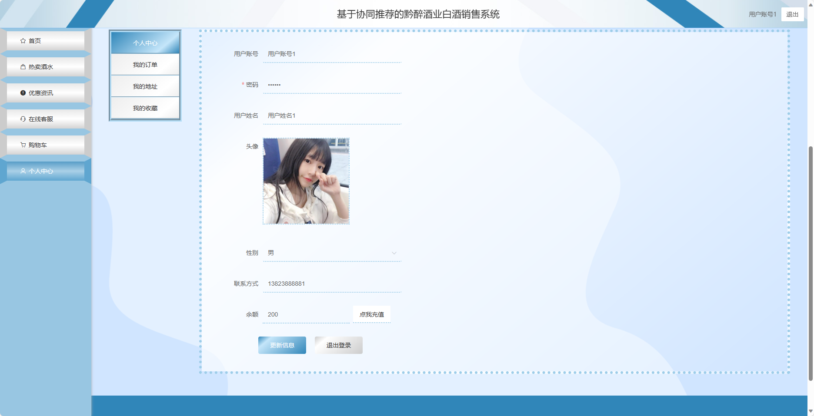
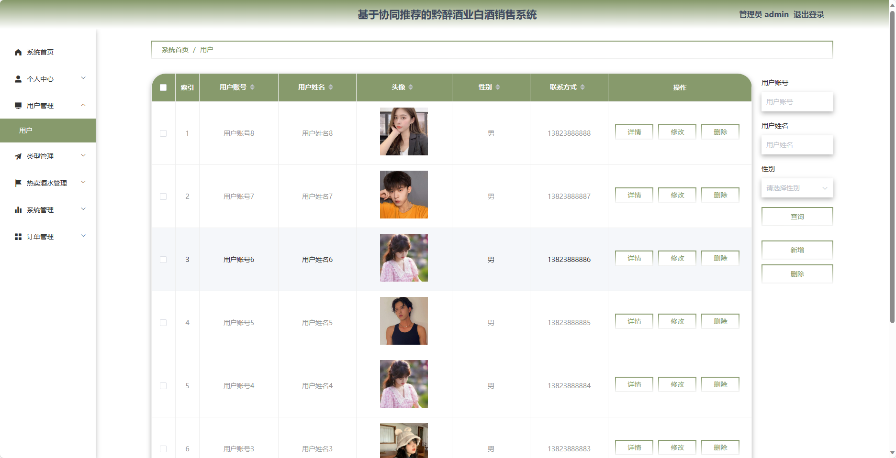
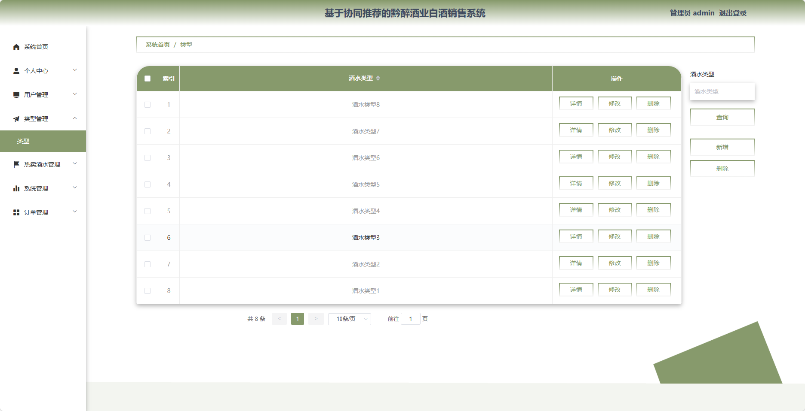
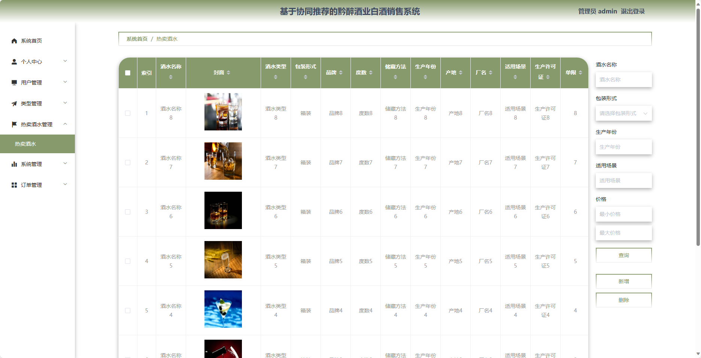

基于SpringBoot的黔醉酒业白酒销售系统（程序+论文）
=
- 完整代码获取地址：从戎源码网 ([https://armycodes.com/](https://armycodes.com/))
- 作者微信：19941326836  QQ：952045282 
- 承接计算机毕业设计、Java毕业设计、Python毕业设计、深度学习、机器学习
- 选题+开题报告+任务书+程序定制+安装调试+论文+答辩ppt 一条龙服务
- 所有选题地址https://github.com/nature924/allProject

一、项目介绍
---
基于Spring Boot框架实现的黔醉酒业白酒销售系统，系统包含两种角色：管理员、用户,系统分为前台和后台两大模块，主要功能如下。

### 前台：

1. 热卖酒水：展示当前热门的酒水产品。
2. 优惠资讯：提供最新的优惠活动和促销信息。
3. 在线客服：用户可以通过在线客服与客服人员进行实时沟通和咨询。
4. 购物车：用户可以将感兴趣的酒水产品加入购物车。
5. 个人中心：用户可以管理个人信息，包括修改密码、查看订单历史等操作。

### 后台：

### 管理员：
1. 个人中心：管理员可以管理个人信息，包括修改密码等操作。
2. 用户管理：管理员可以管理用户信息，包括查看用户列表、禁用用户等操作。
3. 型管理：管理员可以管理酒水的类型信息，包括添加、编辑、删除等操作。
4. 热卖酒水管理：管理员可以管理热卖酒水的信息，包括添加、编辑、删除等操作。
5. 系统管理：管理员可以管理系统的参数设置、日志查看等功能。
6. 订单管理：管理员可以查看用户的订单信息，包括审核、取消等操作。

二、项目技术
---
- 编程语言：Java
- 数据库：MySQL
- 项目管理工具：Maven
- 前端技术：VUE、HTML、Jquery、Bootstrap
- 后端技术：Spring、SpringMVC、MyBatis

三、运行环境
---
- 操作系统：Windows、macOS都可以
- JDK版本：JDK1.8以上都可以
- 开发工具：IDEA、Ecplise、Myecplise都可以
- 数据库: MySQL5.7以上都可以
- Tomcat：任意版本都可以
- Maven：任意版本都可以

四、运行截图
---
### 论文截图：

### 程序截图：

